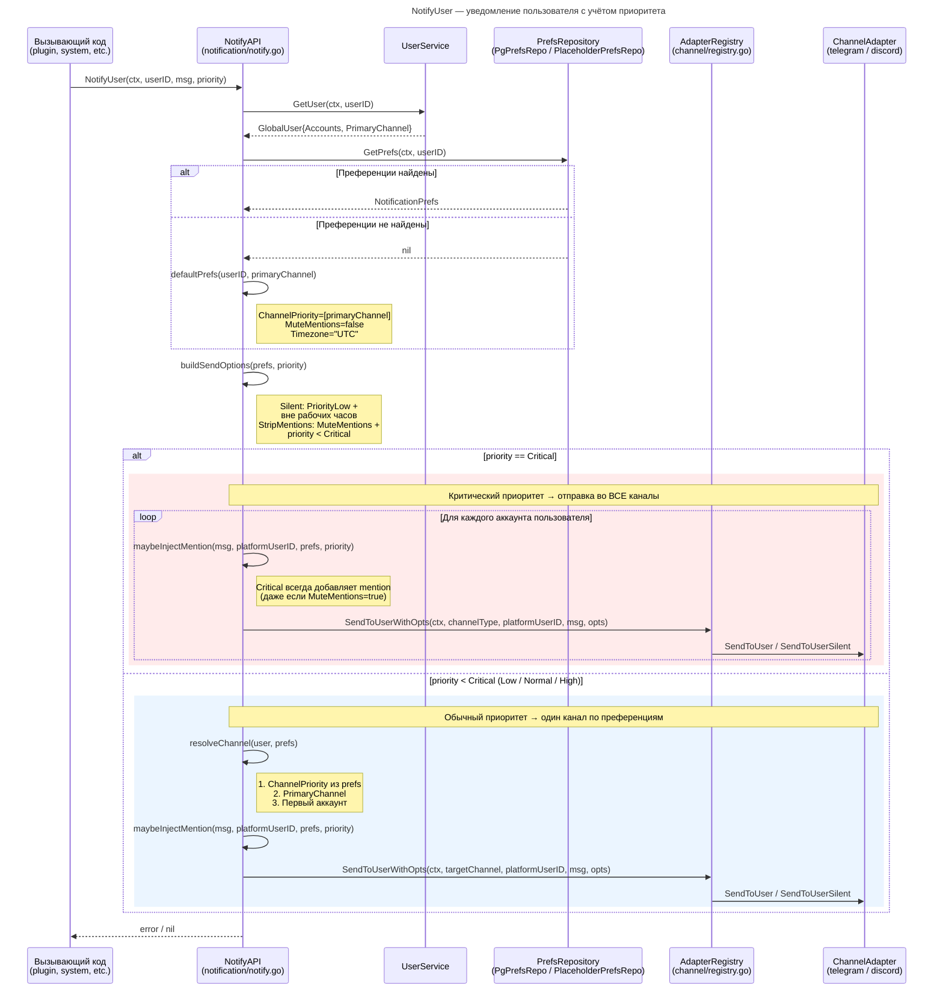
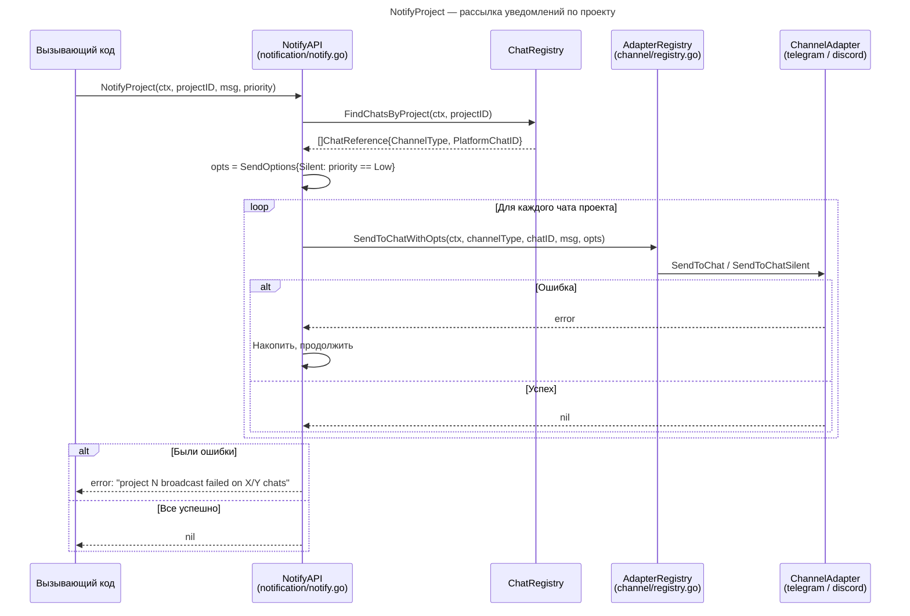
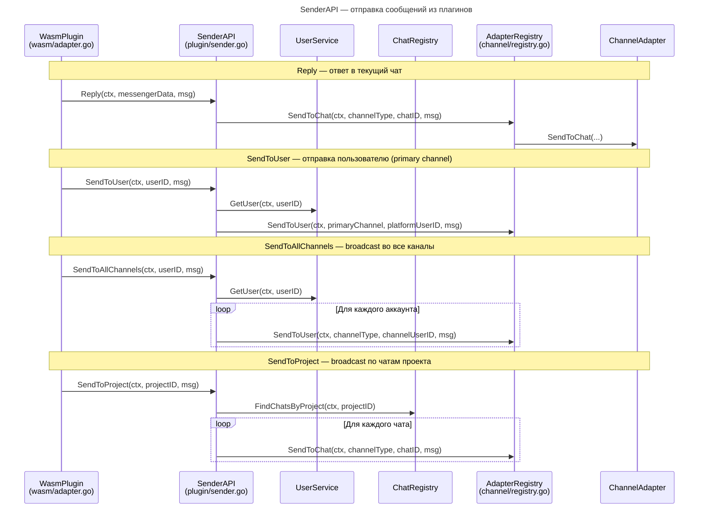
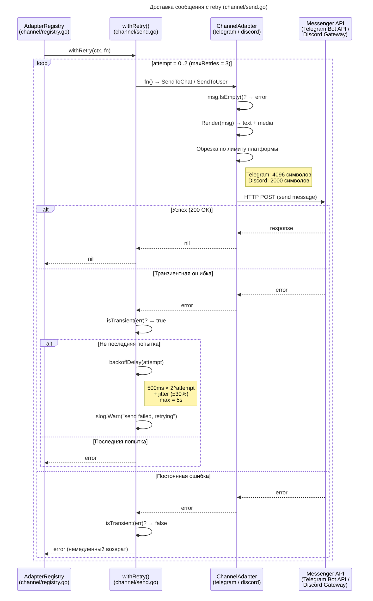

# Сервис нотификаций

## Архитектура

Система доставки сообщений состоит из трёх уровней:

```
┌──────────────────────────────────────────────────────┐
│                    NotifyAPI                          │
│          (приоритеты, преференции, mentions)          │
├──────────────────────────────────────────────────────┤
│                    SenderAPI                          │
│            (маршрутизация по каналам)                 │
├──────────────────────────────────────────────────────┤
│               AdapterRegistry                        │
│       (retry, silent mode, strip mentions)            │
├────────────────┬─────────────────────────────────────┤
│ TelegramAdapter│ DiscordAdapter │  ... (другие)      │
│  (Bot API)     │ (Gateway API)  │                    │
└────────────────┴────────────────┴────────────────────┘
```

| Уровень | Пакет | Ответственность |
|---|---|---|
| **NotifyAPI** | `notification/notify.go` | Приоритеты, преференции пользователя, рабочие часы, auto-mention |
| **SenderAPI** | `plugin/sender.go` | Маршрутизация: reply, send-to-user, broadcast по каналам/проектам |
| **AdapterRegistry** | `channel/registry.go` | Retry с backoff, silent mode, strip mentions, выбор адаптера |
| **ChannelAdapter** | `channel/telegram/`, `channel/discord/` | Рендеринг Message → платформенный формат, отправка через API |

## 1. NotifyUser — уведомление пользователя

Диаграмма: [seq-notify-user.mmd](seq-notify-user.mmd)



### Уровни приоритета

| Приоритет | Константа | Поведение |
|---|---|---|
| **Low** | `PriorityLow` | Silent вне рабочих часов, без mention |
| **Normal** | `PriorityNormal` | Стандартное уведомление со звуком |
| **High** | `PriorityHigh` | Auto-mention пользователя (если не MuteMentions) |
| **Critical** | `PriorityCritical` | Mention + отправка во **все** каналы, никогда не silent |

### Преференции пользователя (NotificationPrefs)

| Поле | Тип | Описание |
|---|---|---|
| `ChannelPriority` | `[]ChannelType` | Порядок предпочтения каналов (telegram, discord, ...) |
| `MuteMentions` | `bool` | Не добавлять auto-mention (кроме Critical) |
| `WorkHoursStart` | `*int` | Начало рабочих часов (0-23) |
| `WorkHoursEnd` | `*int` | Конец рабочих часов (0-23) |
| `Timezone` | `string` | Таймзона (IANA, по умолчанию `"UTC"`) |

Преференции хранятся в таблице `notification_prefs` (PostgreSQL) или in-memory (`PlaceholderPrefsRepo`).

### Логика resolveChannel

Выбор канала для отправки (при priority < Critical):

1. Перебор `ChannelPriority` из преференций — первый канал, на котором у пользователя есть аккаунт
2. `PrimaryChannel` пользователя
3. Первый аккаунт из списка (fallback)

### Логика maybeInjectMention

- `priority < High` → mention не добавляется
- `priority >= High` и `MuteMentions == true` и `priority < Critical` → mention не добавляется
- Если mention для данного `platformUserID` уже есть в блоках → пропуск
- Иначе → `MentionBlock{UserID}` добавляется в начало блоков сообщения

## 2. NotifyProject — рассылка по проекту

Диаграмма: [seq-notify-project.mmd](seq-notify-project.mmd)



Отправка продолжается даже при ошибках в отдельных чатах — ошибки накапливаются и возвращаются как `errors.Join(...)`.

## 3. SenderAPI — отправка из плагинов

Диаграмма: [seq-sender-api.mmd](seq-sender-api.mmd)



| Метод | Описание |
|---|---|
| `Reply(ctx, messengerData, msg)` | Ответ в чат, из которого пришло сообщение |
| `ReplyToChat(ctx, channelType, chatID, msg)` | Отправка в конкретный чат по типу канала и ID |
| `SendToUser(ctx, userID, msg)` | Отправка пользователю через primary channel |
| `SendToAllChannels(ctx, userID, msg)` | Broadcast во все подключённые каналы пользователя |
| `SendToProject(ctx, projectID, msg)` | Broadcast во все чаты, привязанные к проекту |

## 4. Доставка с retry

Диаграмма: [seq-send-retry.mmd](seq-send-retry.mmd)



### Параметры retry

| Параметр | Значение | Описание |
|---|---|---|
| `maxRetries` | `3` | Максимум попыток |
| `baseDelay` | `500ms` | Базовая задержка |
| `maxDelay` | `5s` | Максимальная задержка |
| `jitterPercent` | `0.3` (±30%) | Случайное отклонение для предотвращения thundering herd |

### Транзиентные ошибки (повтор)

- `net.Error` (любая сетевая ошибка)
- `429 Too Many Requests` / `retry after`
- `timeout` / `EOF` / `connection reset` / `connection refused`
- `502 Bad Gateway` / `503 Service Unavailable` / `504 Gateway Timeout`
- `500 Internal Server Error` / `temporary failure`

### Постоянные ошибки (без повтора)

- `400 Bad Request` — невалидное сообщение
- `401 Unauthorized` / `403 Forbidden` — проблемы авторизации
- `404 Not Found` — чат/пользователь не существует
- Любые ошибки, не попавшие под паттерны выше

## 5. Silent mode и SilentSender

Интерфейс `SilentSender` — опциональное расширение для адаптеров, поддерживающих тихую доставку (без звуковых уведомлений на устройстве пользователя):

```go
type SilentSender interface {
    SendToUserSilent(ctx, platformUserID, msg, silent) error
    SendToChatSilent(ctx, chatID, msg, silent) error
}
```

| Адаптер | Реализует SilentSender | Механизм |
|---|---|---|
| **Telegram** | Да | `tele.SendOptions{DisableNotification: true}` |
| **Discord** | Да | `discordgo.MessageFlagsSuppressNotifications` |

Если адаптер не реализует `SilentSender`, сообщение отправляется обычным способом (fallback на `SendToChat`/`SendToUser`).

### Когда включается Silent

- `PriorityLow` + пользователь **вне рабочих часов** → `Silent: true`
- `NotifyChat` / `NotifyProject` с `PriorityLow` → `Silent: true`

## Разница между NotifyAPI и SenderAPI

| | NotifyAPI | SenderAPI |
|---|---|---|
| **Уровень** | Высокоуровневый | Низкоуровневый |
| **Приоритеты** | Да (Low → Critical) | Нет |
| **Преференции** | Да (канал, mentions, часы) | Нет |
| **Auto-mention** | Да (High, Critical) | Нет |
| **Silent mode** | Да (по приоритету + часам) | Нет |
| **Выбор канала** | По преференциям | Явный или primary |
| **Применение** | Системные уведомления | Ответы плагинов, broadcast |
