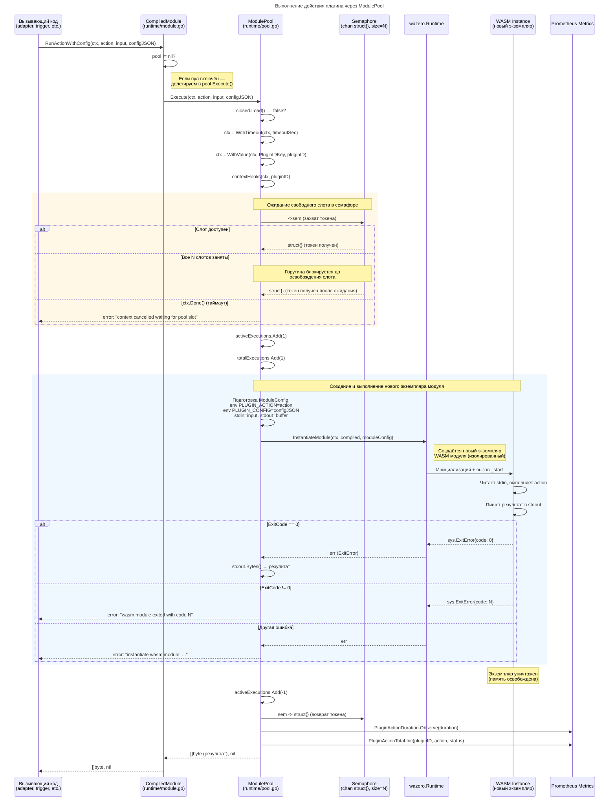
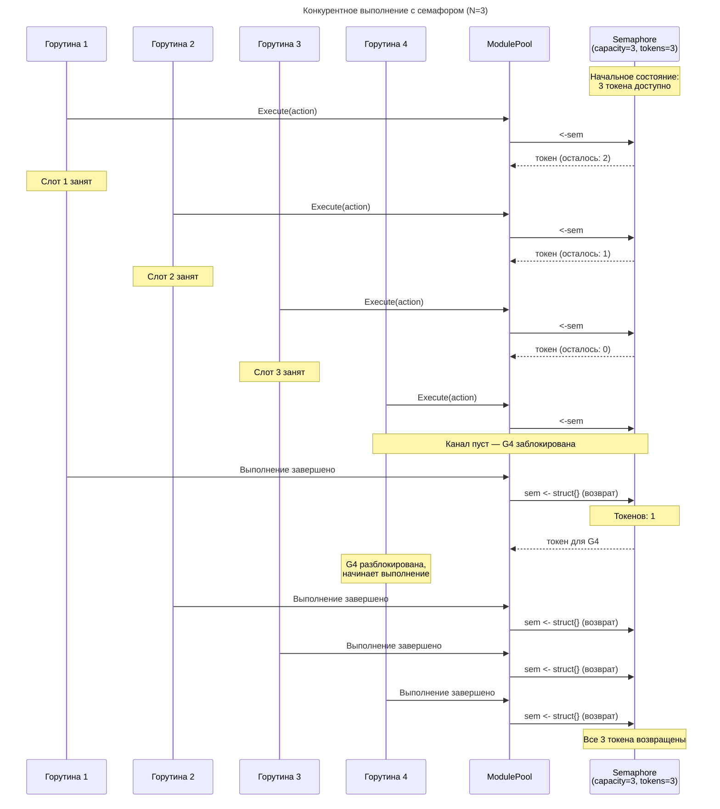
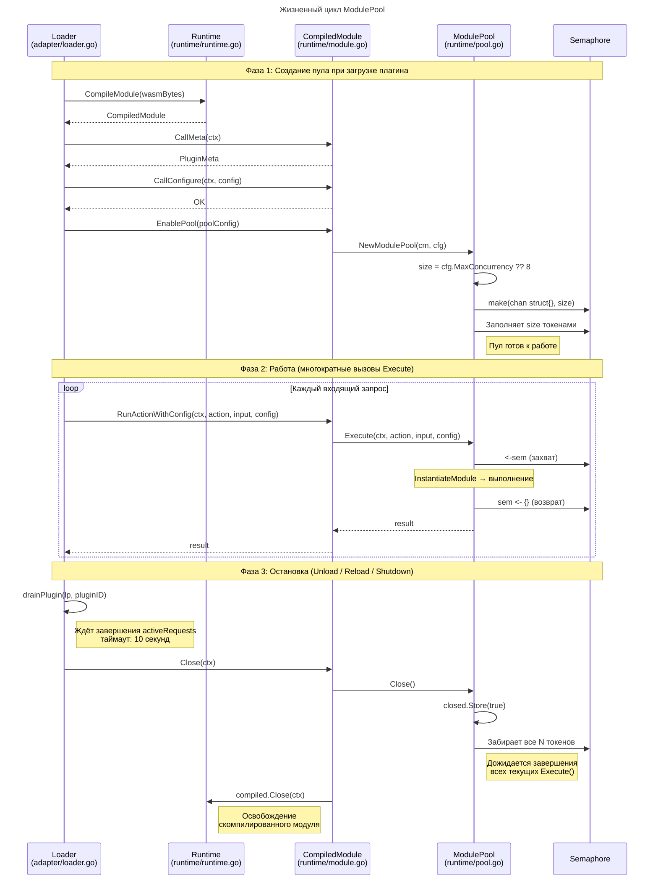
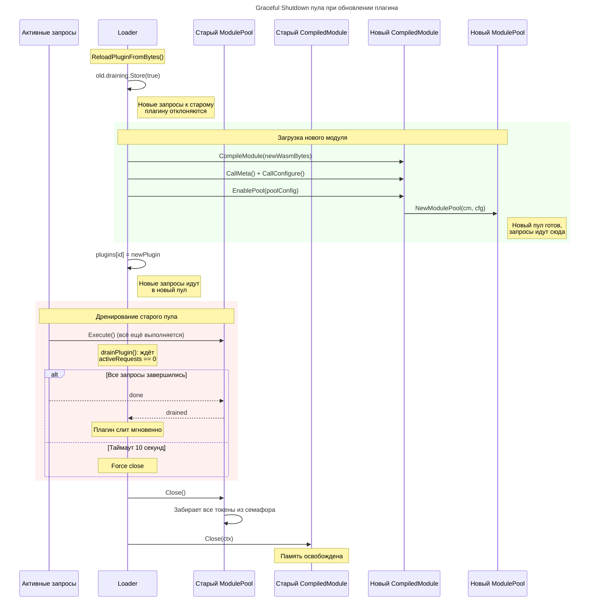

# Пул плагинов (ModulePool)

## Общая идея

`ModulePool` — это **семафорный пул**, который ограничивает количество одновременно выполняющихся экземпляров одного WASM-плагина. Он **не хранит заранее созданные экземпляры модулей**: каждый вызов создаёт новый экземпляр WASM-модуля через `wazero.InstantiateModule`, а пул лишь контролирует, сколько таких экземпляров могут работать параллельно.

## 1. Выполнение действия через пул (Execute)

Диаграмма: [seq-pool-execute.mmd](seq-pool-execute.mmd)

## 2. Конкурентное выполнение (семафор)

Диаграмма: [seq-pool-concurrency.mmd](seq-pool-concurrency.mmd)

## 3. Жизненный цикл пула

Диаграмма: [seq-pool-lifecycle.mmd](seq-pool-lifecycle.mmd)

## 4. Graceful shutdown при обновлении плагина

Диаграмма: [seq-pool-reload.mmd](seq-pool-reload.mmd)

## Конфигурация

| Параметр | По умолчанию | Описание |
|---|---|---|
| `PoolMaxConcurrency` | `8` | Максимум одновременных выполнений на один плагин |
| `PoolMaxConcurrency = -1` | — | Безлимитный режим: семафор отключён, `sem = nil` |
| `PoolMaxConcurrency = 0` | `8` | Используется значение по умолчанию |

Параметр задаётся в `Config.PoolMaxConcurrency` при создании `Runtime`.

## Почему не пул экземпляров

WASM-модули в wazero с AOT-компиляцией инстанцируются очень быстро (доли миллисекунды). Держать заранее созданные экземпляры невыгодно:

- **Каждый экземпляр потребляет память** (линейная память WASM, стек, таблицы).
- **Нет общего состояния** — плагины работают как чистые функции (stdin -> stdout), повторное использование экземпляра не даёт преимуществ.
- **Изоляция** — каждый вызов получает чистое окружение без побочных эффектов от предыдущих вызовов.

## Статистика

Пул собирает метрики для мониторинга:

| Метрика | Описание |
|---|---|
| `PoolSize` | Размер пула (макс. одновременных выполнений) |
| `ActiveExecutions` | Сколько выполняется прямо сейчас |
| `TotalExecutions` | Всего выполнений за время жизни пула |
| `AvgWaitTimeMs` | Среднее время ожидания свободного слота (мс) |
| `AvgInstantiateMs` | Среднее время инстанцирования WASM модуля (мс) |

Если `AvgWaitTimeMs` растёт — стоит увеличить `PoolMaxConcurrency`. Если нагрузка невелика — можно уменьшить для экономии ресурсов.
