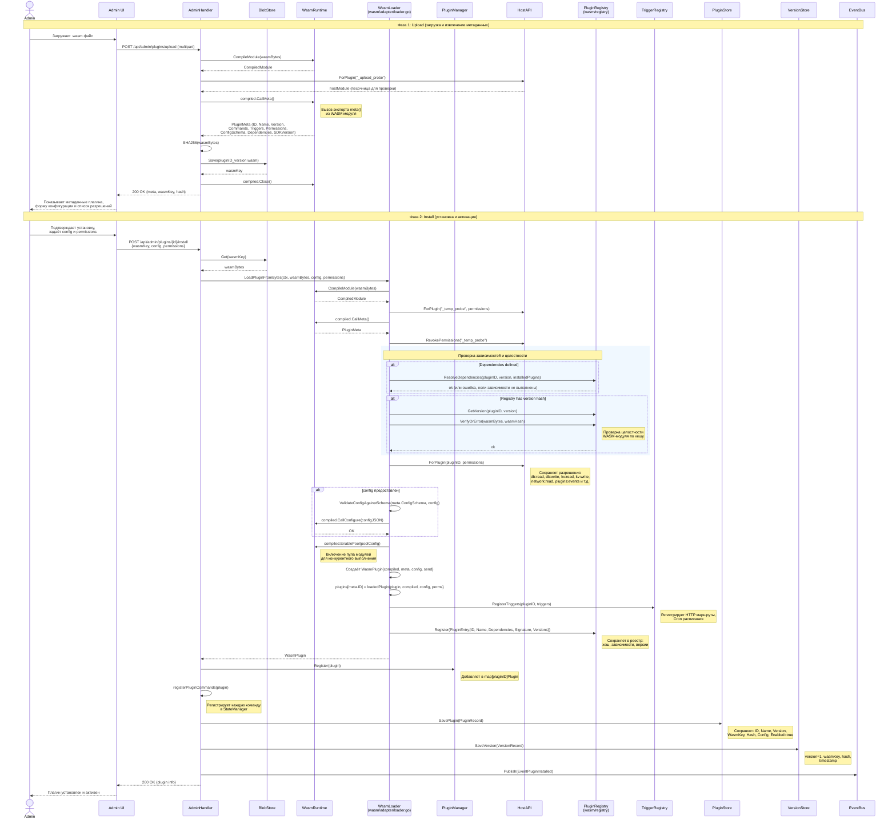
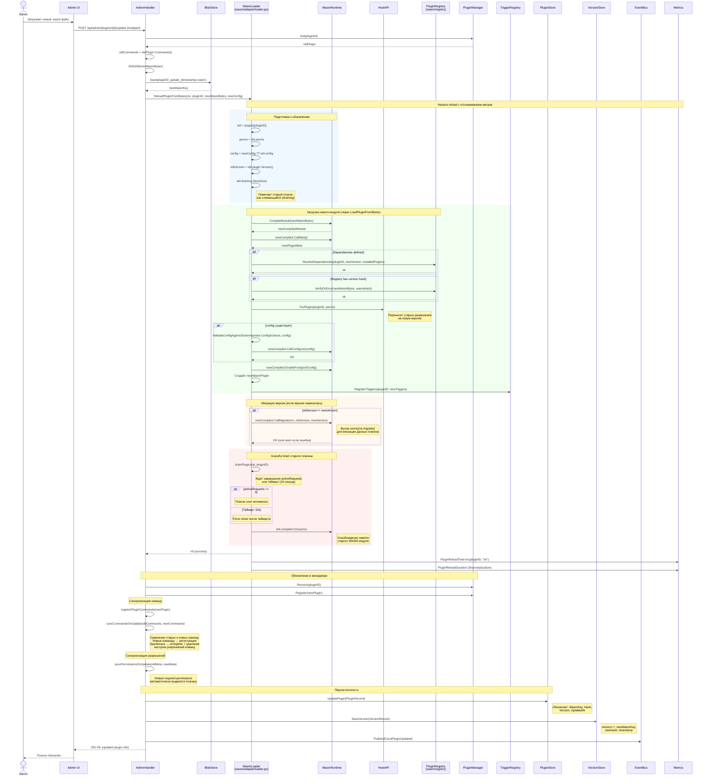

# Plugin Sequence Diagrams

## 1. Добавление нового плагина (Upload + Install)

## 2. Обновление существующего плагина

## Ключевые отличия между добавлением и обновлением

| Аспект | Добавление (Install) | Обновление (Update) |
|--------|---------------------|---------------------|
| Фазы | 2 фазы: Upload → Install | 1 фаза: Upload + обновление |
| Метаданные | Извлекаются и показываются пользователю для подтверждения | Извлекаются автоматически |
| Конфигурация | Задаётся пользователем | Наследуется от старой версии (если не задана новая) |
| Разрешения | Задаются пользователем | Переносятся + автовыдача новых |
| Зависимости | Проверяются ResolveDependencies | Проверяются ResolveDependencies |
| Целостность | Проверяется VerifyOrError | Проверяется VerifyOrError |
| Команды | Просто регистрируются | Синхронизация: добавление новых, удаление убранных |
| Триггеры | Регистрируются | Перерегистрация (unreg + reg) |
| Старый модуль | — | Graceful drain → Close |
| Миграция | — | CallMigrate(oldVersion, newVersion) |
| Метрики | — | PluginReloadTotal, PluginReloadDuration |
| Событие | `EventPluginInstalled` | `EventPluginUpdated` |
