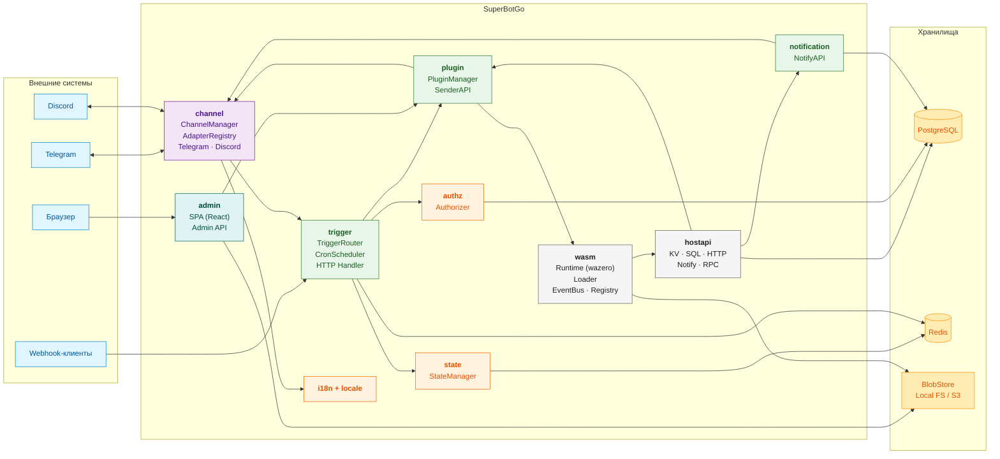
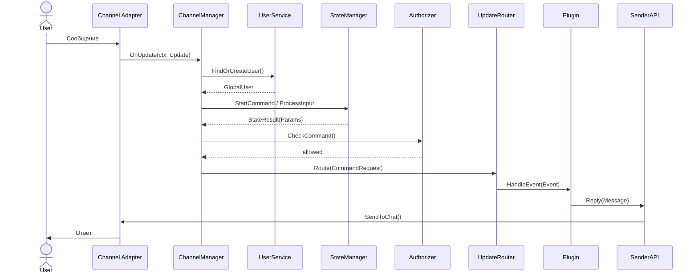
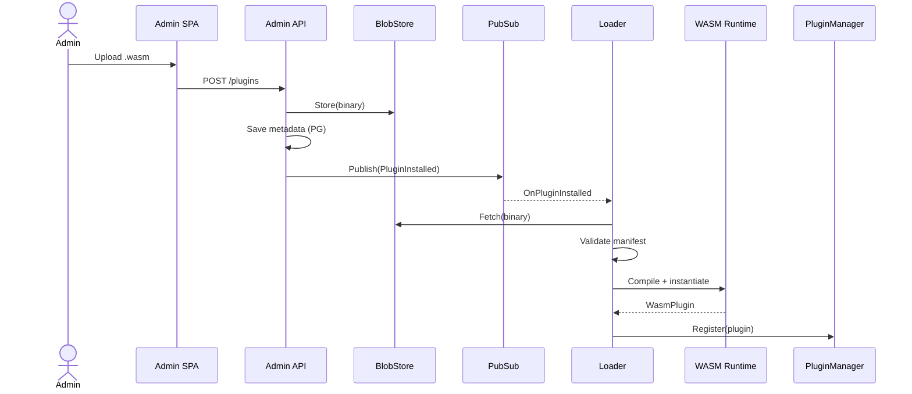
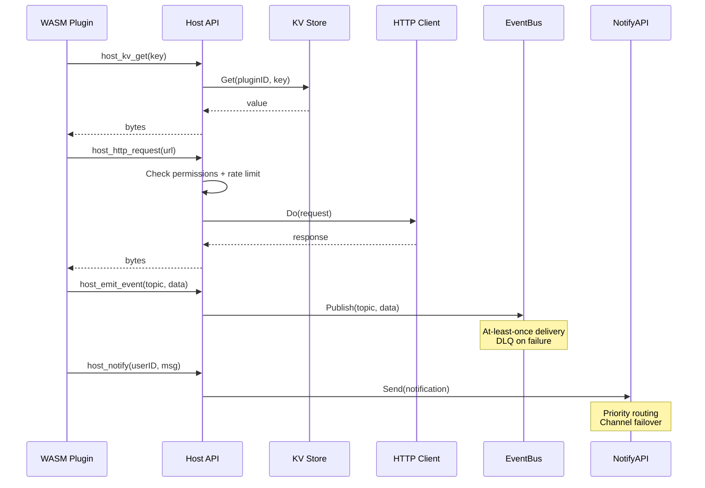

# Диаграмма компонентов

Общая архитектура SuperBotGo — от пользователя до базы данных.

## Обзор системы

## Описание компонентов

### `internal/channel`

| Компонент | Файл | Назначение |
|-----------|------|------------|
| **ChannelManager** | `manager.go` | Точка входа для входящих сообщений. Оркестрирует пользователя, состояние, авторизацию, маршрутизацию |
| **AdapterRegistry** | `registry.go` | Реестр каналов; маршрутизация исходящих сообщений по `ChannelType` |
| **Telegram Adapter** | `telegram/` | Приём и отправка сообщений через Telegram Bot API |
| **Discord Adapter** | `discord/` | Приём и отправка сообщений через Discord Gateway |

### `internal/state`

| Компонент | Файл | Назначение |
|-----------|------|------------|
| **StateManager** | `manager.go` | Управление многошаговыми диалогами. Хранит состояние в Redis |

### `internal/authz`

| Компонент | Файл | Назначение |
|-----------|------|------------|
| **Authorizer** | `authorizer.go` | RBAC-авторизация с TTL-кешем и expr-lang для оценки политик. Управление ролями |

### `internal/plugin`

| Компонент | Файл | Назначение |
|-----------|------|------------|
| **UpdateRouter** | `router.go` | Маршрутизация `CommandRequest` в нужный плагин |
| **PluginManager** | `manager.go` | Реестр и жизненный цикл плагинов (native + WASM) |
| **SenderAPI** | `sender.go` | Высокоуровневый API для отправки сообщений из плагинов |

### `internal/wasm`

| Компонент | Файл | Назначение |
|-----------|------|------------|
| **Runtime** | `runtime/` | Движок WebAssembly на базе wazero. Пул инстансов, AOT-кеш, лимиты памяти |
| **Loader** | `adapter/loader.go` | Загрузка `.wasm` модулей, hot-reload, валидация манифеста |
| **Host API** | `hostapi/` | Функции хоста для WASM: HTTP, KV, SQL, уведомления, RPC между плагинами |
| **EventBus** | `eventbus/` | Pub/sub для плагинов. At-least-once доставка, DLQ, retry с backoff |
| **Registry** | `registry/` | Версии, зависимости, подписи плагинов |

### `internal/trigger`

| Компонент | Файл | Назначение |
|-----------|------|------------|
| **TriggerRouter** | `router.go` | Маршрутизация событий (HTTP, Cron, Event) в плагины |
| **CronScheduler** | `cron.go` | Распределённый cron с блокировкой через Redis |
| **HTTP Handler** | `http.go` | Приём webhook-запросов |

### `internal/notification`

| Компонент | Файл | Назначение |
|-----------|------|------------|
| **NotifyAPI** | `notify.go` | Маршрутизация уведомлений с учётом приоритета, рабочих часов, предпочтений канала. Failover между каналами |

### `internal/i18n` + `internal/locale`

| Компонент | Назначение |
|-----------|------------|
| **i18n** | Мультиязычность: резолвинг локали пользователя/чата, TOML-файлы переводов |

### `internal/admin`

| Компонент | Файл | Назначение |
|-----------|------|------------|
| **SPA** | `web/admin/` | React-приложение для управления платформой |
| **Admin API** | `api/` | REST API: загрузка/установка плагинов, управление правами, статусы каналов |

### Внешние хранилища

| Компонент | Назначение |
|-----------|------------|
| **PostgreSQL** | Основная БД: пользователи, чаты, роли, плагины, уведомления, авторизация |
| **Redis** | Состояние диалогов, распределённые блокировки, TTL-кеш |
| **BlobStore** | Хранение `.wasm` файлов (Local FS или S3/MinIO). Используется Admin API и Loader |

## Потоки данных

### Обработка сообщения пользователя

### Загрузка WASM-плагина

### Выполнение WASM host-вызова

