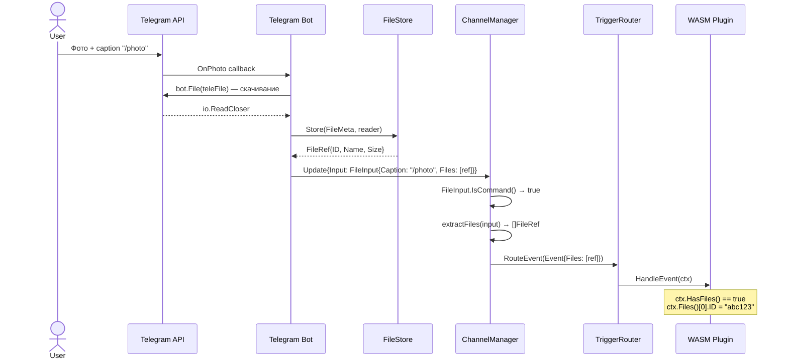
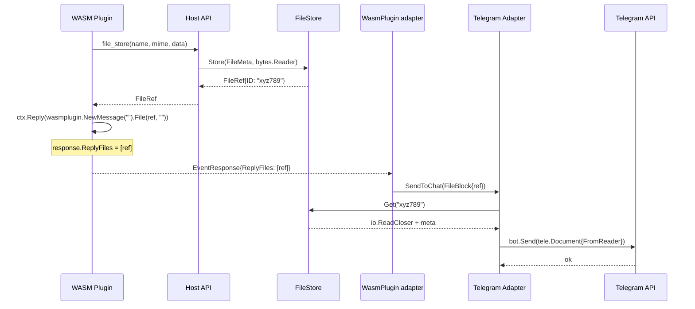

# Файловая подсистема

Файловая подсистема отвечает за приём, хранение, чтение и отправку файлов пользователей через мессенджеры. Она интегрирована на всех уровнях: от адаптеров каналов до WASM host API.

## Типы модели

### Входящие файлы

```
internal/model/file.go     — FileRef, FileType
internal/model/input.go    — FileInput (implements UserInput)
```

`FileInput` реализует интерфейс `UserInput`. Если caption начинается с `/` — роутится как команда с прикреплёнными файлами. Если caption пустой и нет активного диалога — игнорируется.

```go
type FileInput struct {
    Caption string       // текст/caption сообщения
    Files   []FileRef    // прикреплённые файлы
}

type FileRef struct {
    ID       string      // UUID в FileStore
    Name     string      // оригинальное имя файла
    MIMEType string      // MIME-тип
    Size     int64       // размер в байтах
    FileType FileType    // photo, document, audio, video, voice, sticker
}
```

### Исходящие файлы

```
internal/model/message.go  — FileBlock (implements ContentBlock)
```

`FileBlock` — блок контента для отправки файлов в сообщении:

```go
type FileBlock struct {
    FileRef FileRef
    Caption string
}
```

### Event data

`MessengerTriggerData.Files` и `CommandRequest.Files` — пробрасывают `[]FileRef` от адаптера до плагина. `EventResponse.ReplyFiles` — файлы, которые плагин хочет отправить обратно.

## FileStore

```
internal/filestore/filestore.go  — интерфейс
internal/filestore/s3.go         — S3 реализация
```

Отдельная абстракция (не переиспользует admin `BlobStore`), т.к. нужны метаданные, TTL и cleanup.

```go
type FileStore interface {
    Store(ctx, meta FileMeta, data io.Reader) (FileRef, error)
    Get(ctx, id string) (io.ReadCloser, *FileMeta, error)
    Meta(ctx, id string) (*FileMeta, error)
    Delete(ctx, id string) error
    URL(ctx, id string, expiry time.Duration) (string, error)
    Cleanup(ctx) (int, error)
}
```

### FileMeta

```go
type FileMeta struct {
    ID        string         // генерируется при Store
    Name      string
    MIMEType  string
    Size      int64
    FileType  model.FileType
    PluginID  string         // кто сохранил ("" для входящих)
    CreatedAt time.Time
    ExpiresAt *time.Time     // TTL (nil = без ограничения)
}
```

### S3

Файлы хранятся в S3-совместимом хранилище (AWS S3, MinIO) как два объекта:

```
<prefix><id>.data       — содержимое
<prefix><id>.meta.json  — метаданные (JSON)
```

- `URL()` — возвращает presigned GET URL для прямого скачивания из S3
- `Cleanup()` — листинг `.meta.json` объектов, проверка `ExpiresAt`, удаление просроченных. Запускается горутиной каждый час

## Поток данных: входящий файл



## Поток данных: исходящий файл



## Host-функции

4 host-функции в `internal/wasm/hostapi/host_file.go`, зарегистрированные в `hostapi.go`:

| Функция | Описание | Лимит |
|---|---|---|
| `file_meta` | Метаданные файла по ID | — |
| `file_read` | Чтение содержимого (чанками до 1 МБ) | — |
| `file_url` | Временный URL для скачивания | — |
| `file_store` | Сохранение нового файла | — |

Все функции требуют permission `"file"`, который назначается из requirement `File(desc)`.

### Конвейер вызова

Каждая file host-функция проходит стандартный конвейер:

1. `CheckPermission(pluginID, "file")` — проверка разрешений
2. `readPayload` + `msgpack.Unmarshal` — десериализация запроса
3. Проверка `deps.FileStore != nil` — доступность зависимости
4. Выполнение операции с FileStore
5. `writeResult` — сериализация ответа обратно в WASM memory

### Wire-формат (msgpack)

**file_store request:**
```
name: string, mime_type: string, file_type: string,
data: bytes, ttl_seconds: int
```

**file_store response:**
```
id: string, name: string, mime_type: string,
size: int64, file_type: string
```

**file_read request:**
```
file_id: string, offset: int64, length: int64
```

**file_read response:**
```
data: bytes, bytes_read: int64, eof: bool
```

## Renderer

`FileBlock` обрабатывается в `internal/channel/renderer.go`:

```go
case model.FileBlock:
    parts.FileRefs = append(parts.FileRefs, b.FileRef)
```

Каждый платформенный renderer (`telegram/renderer.go`, `discord/renderer.go`) пробрасывает `FileRefs` в `RenderedMessage`. Адаптер затем:

- **Telegram**: читает из FileStore, отправляет как `tele.Document{FromReader}`
- **Discord**: читает из FileStore, добавляет как `discordgo.File` в `MessageSend.Files`

## Конфигурация

```yaml
filestore:
  default_ttl: 24h          # TTL по умолчанию
  max_file_size: 52428800   # 50 МБ
  s3:
    bucket: my-bucket
    region: eu-central-1
    endpoint: http://localhost:9000  # MinIO для dev
    access_key: minioadmin
    secret_key: minioadmin
    prefix: files/
```
