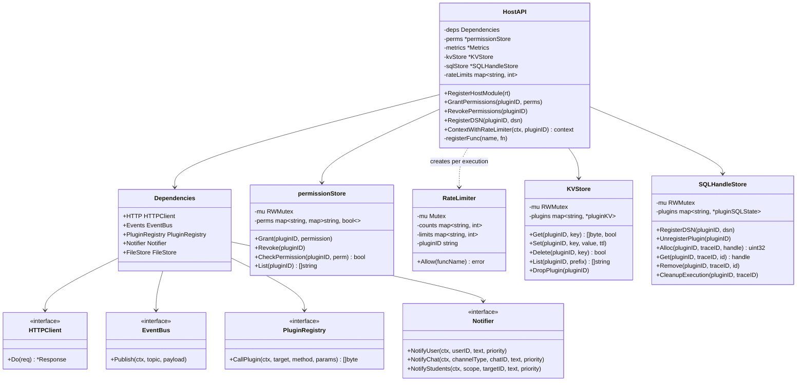
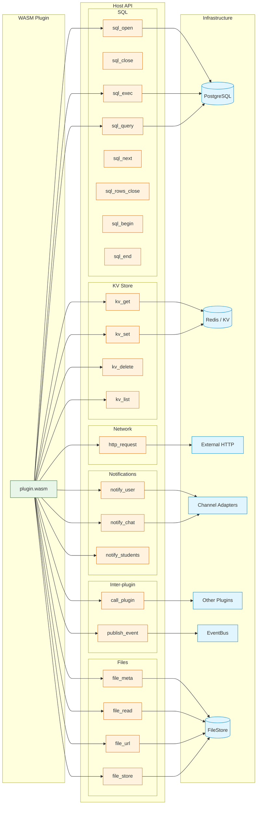
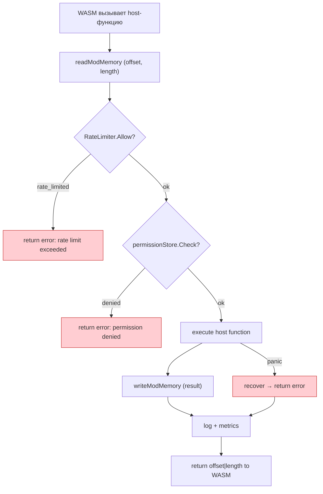
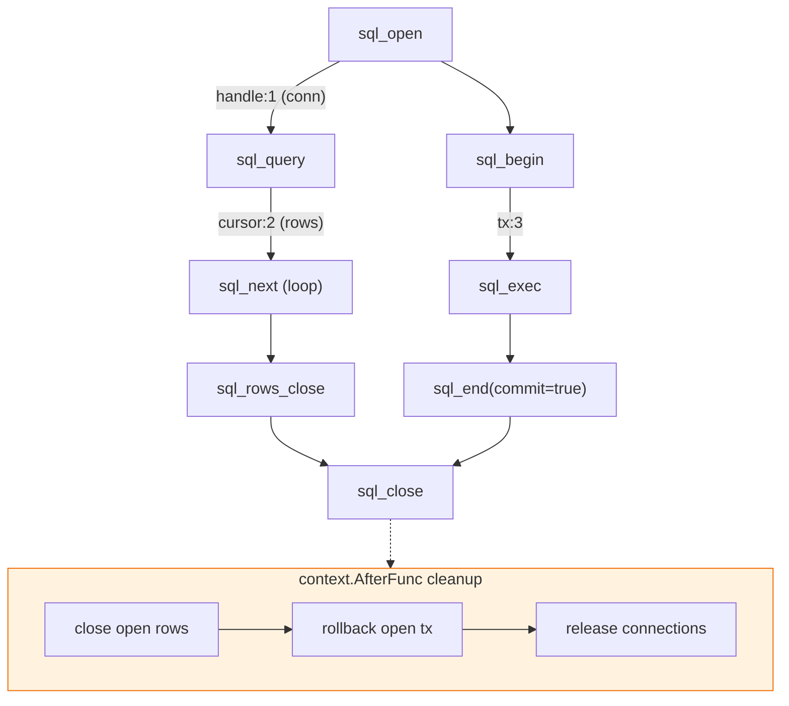
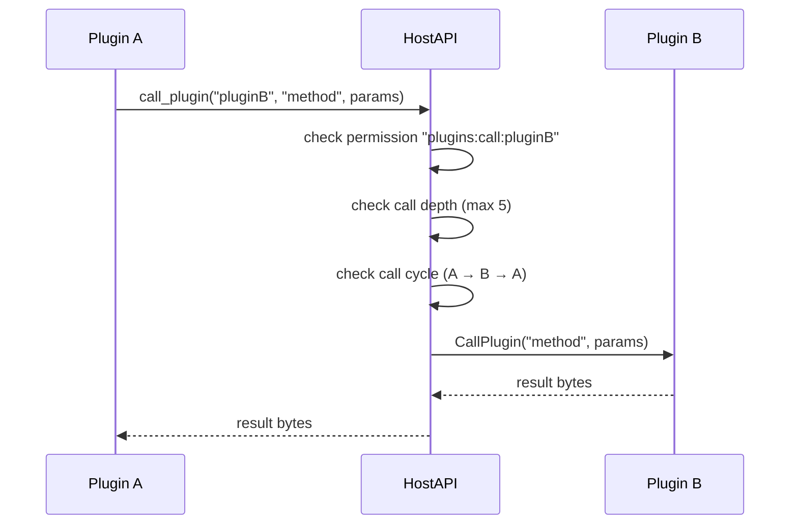

# Host API (WASM)

Host API — набор функций, доступных WASM-плагинам для взаимодействия с платформой.
Все вызовы проходят через единый конвейер: проверка разрешений, rate limiting, трассировка,
автоочистка ресурсов.

## Диаграмма классов



## Все host-функции



## Конвейер вызова

Каждый host-вызов проходит через единый wrapper в `registerFunc`:



## Система разрешений

Разрешения назначаются плагину при установке на основе `requirements` из манифеста.

| Requirement | Permission | Что даёт |
|------------|------------|----------|
| `database` | `sql` | Доступ к `sql_*` функциям |
| `http` | `network` | Доступ к `http_request` |
| `kv` | `kv` | Доступ к `kv_*` функциям |
| `notify` | `notify` | Доступ к `notify_*` функциям |
| `events` | `events` | Доступ к `publish_event` |
| `file` | `file` | Доступ к `file_*` функциям |
| `plugin:X` | `plugins:call:X` | Вызов конкретного плагина X |

Проверка — **перед каждым вызовом**. Без разрешения вызов возвращает ошибку,
WASM-модуль не получает доступа к ресурсу.

## Rate Limits

Лимиты **на одно выполнение** (один HandleEvent):

| Функция | Лимит | | Функция | Лимит |
|---------|------:|-|---------|------:|
| `kv_get` | 200 | | `sql_open` | 10 |
| `kv_set` | 200 | | `sql_exec` | 100 |
| `kv_delete` | 100 | | `sql_query` | 100 |
| `kv_list` | 50 | | `sql_next` | 5000 |
| `http_request` | 20 | | `sql_begin` | 20 |
| `call_plugin` | 10 | | `sql_end` | 20 |
| `publish_event` | 50 | | `sql_close` | 10 |

`RateLimiter` создаётся через context hook на каждое выполнение и сбрасывается после.

## Сетевая песочница

`http_request` блокирует обращения к:

| Заблокировано | Причина |
|---------------|---------|
| `localhost`, `127.0.0.1`, `::1` | Loopback |
| `10.0.0.0/8`, `172.16.0.0/12`, `192.168.0.0/16` | RFC 1918 (приватные сети) |
| `169.254.169.254`, `metadata.google.internal` | Cloud metadata API (SSRF) |
| `169.254.0.0/16` | Link-local |

## SQL: управление ресурсами



- Макс. хэндлов на выполнение: **16** (connections + transactions + result sets)
- Таймаут SQL-операций: **4 секунды**
- `CleanupExecution` вызывается через `context.AfterFunc` — автоочистка при завершении

### Лимиты KV Store

| Параметр | Лимит |
|----------|-------|
| Макс. ключей на плагин | 1 000 |
| Макс. размер значения | 64 KB |
| Макс. объём на плагин | 10 MB |
| TTL | опционально, per key |

## Inter-plugin RPC



Защиты:
- **Max call depth**: 5 уровней вложенности
- **Cycle detection**: A → B → A блокируется
- **Permission**: нужен `plugins:call:{target}` для каждого целевого плагина

## Wire Protocol

Все host-функции используют единый формат сериализации:

```
┌────────┬──────────────────────────┐
│ 0x01   │  MessagePack payload     │
│ 1 byte │  variable length         │
└────────┴──────────────────────────┘
```

Параметры передаются через WASM memory:
- **Вызов**: `(offset: i32, length: i32)` → host читает из памяти WASM
- **Возврат**: `i64` = `(offset << 32) | length` → host пишет в память WASM через `alloc`

## Трассировка

Каждое выполнение получает `traceID` (16 случайных hex-байт).
Все host-вызовы логируются с:

```
trace_id, plugin_id, function, duration_ms, status (ok | error | rate_limited)
```

Пример из логов:
```
level=INFO msg="host api call" trace_id=789a8b69 plugin_id=schedule function=sql_query duration_ms=3 status=ok
```
