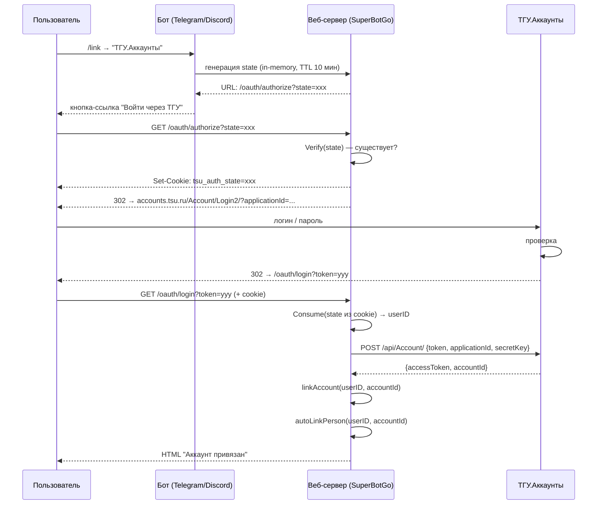
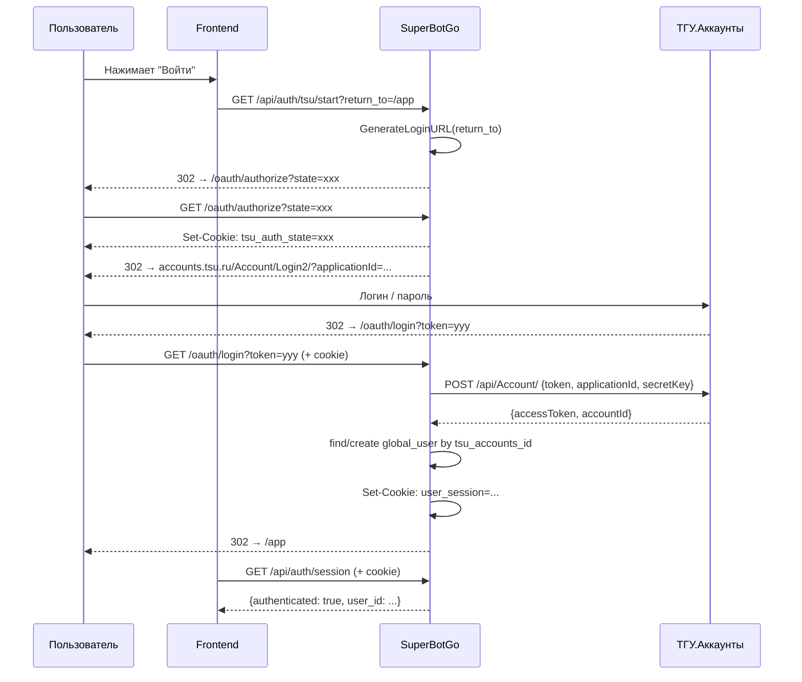
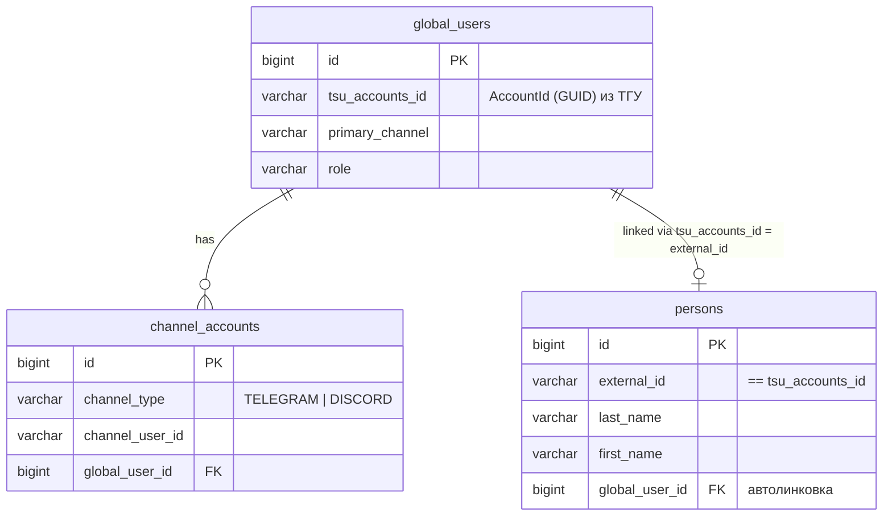

# Авторизация через ТГУ.Аккаунты

Интеграция с внешним сервисом аутентификации **ТГУ.Аккаунты**.
Используется для привязки учётной записи ТГУ к глобальному пользователю бота
и автоматической линковки с записью `person` из университетского синка.
Также используется для browser login во фронтендах, которые работают через host-сессию.

## Общая схема



## Browser login для фронтендов

Для фронтов авторизация строится через **TSU -> host session cookie**.
Фронтенду не нужно хранить TSU token или service key.



### Интеграционный контракт для frontend

1. Для старта логина браузер нужно отправлять на:

```text
GET /api/auth/tsu/start?return_to=/app
```

2. После загрузки приложения фронт проверяет сессию:

```ts
const res = await fetch('/api/auth/session', { credentials: 'include' })
const data = await res.json()
```

3. Все вызовы пользовательских HTTP-trigger endpoint'ов выполняются с cookie:

```ts
await fetch('/api/triggers/http/my-plugin/profile', {
  method: 'GET',
  credentials: 'include',
})
```

4. Logout:

```ts
await fetch('/api/auth/logout', {
  method: 'POST',
  credentials: 'include',
})
```

### Замечания

- Для frontend-сценария по умолчанию используется cookie `user_session`.
- Cookie выставляется как `HttpOnly`, поэтому frontend не читает её напрямую.
- Текущая схема ориентирована на same-origin / same-site frontend.
- `service-key` предназначен только для server-to-server интеграций и не нужен браузеру.

## TSU login в админке

Админка поддерживает два варианта входа:

- через email + password, что выдаёт `admin_session`
- через ТГУ.Аккаунты, что выдаёт обычный `user_session`

Во втором случае `/api/admin/*` пропускает запрос только если этот `global_user_id` действительно имеет admin credentials. То есть TSU-login не даёт admin access сам по себе, а только для уже назначенных администраторов.

### Endpoint'ы админской авторизации

#### Вход через email + password

```http
POST /api/admin/auth/login
Content-Type: application/json

{
  "email": "admin@example.com",
  "password": "secret"
}
```

При успехе сервер ставит cookie `admin_session`.

#### Вход через ТГУ

```http
GET /api/auth/tsu/start?return_to=/admin/plugins
```

Дальше браузер проходит обычный TSU flow через:

- `GET /oauth/authorize?state=...`
- `GET /oauth/login?token=...`

При успехе сервер ставит cookie `user_session`.

#### Проверка сессии админки

```http
GET /api/admin/auth/check
```

Этот endpoint считает пользователя аутентифицированным для админки, если выполнено одно из условий:

- есть валидный `admin_session`
- или есть валидный `user_session`, и этот `global_user_id` имеет admin credentials

#### Logout из админки

```http
POST /api/admin/auth/logout
```

Сервер очищает `admin_session`. Если пользователь вошёл через ТГУ, дополнительно очищается и `user_session`.

#### Смена пароля администратора

```http
PUT /api/admin/auth/password
Content-Type: application/json

{
  "current_password": "old-secret",
  "new_password": "new-secret"
}
```

Этот endpoint доступен только для администраторов, вошедших по email/password.

## Пользовательские bearer tokens

Если кроме браузера нужен ещё API-клиент без cookie, пользователь может выпустить bearer token из уже существующей host-сессии:

```http
POST /api/auth/tokens
Content-Type: application/json
Cookie: user_session=...

{"name":"CLI token","expires_at":"2026-05-01T00:00:00Z"}
```

Ответ содержит токен один раз:

```json
{
  "id": 1,
  "name": "CLI token",
  "token": "sbuk_<public>.<secret>"
}
```

Дальше такой токен можно использовать в HTTP-trigger запросах:

```http
Authorization: Bearer sbuk_<public>.<secret>
```

Для администраторов эти endpoint'ы также работают после входа по email/password, то есть через `admin_session` без отдельного TSU-login.

Доступные endpoint'ы:

- `GET /api/auth/tokens`
- `POST /api/auth/tokens`
- `DELETE /api/auth/tokens/{id}`

## Модель данных



## Конфигурация

```yaml
tsu_accounts:
  application_id: "12345"
  secret_key: "hoho..."
  callback_url: "https://bot.example.com/oauth/login"
  base_url: "https://accounts.kreosoft.space"

user_auth:
  session_secret: "change-me"
```

Env-переменные:
- `BOT_TSU__ACCOUNTS_APPLICATION__ID`
- `BOT_TSU__ACCOUNTS_SECRET__KEY`
- `BOT_TSU__ACCOUNTS_CALLBACK__URL`
- `BOT_TSU__ACCOUNTS_BASE__URL`

## HTTP-эндпоинты

| Метод | Путь | Описание |
|-------|------|----------|
| POST | `/api/admin/auth/login` | Вход в админку по email/password |
| GET | `/api/admin/auth/check` | Проверка текущей admin-сессии |
| POST | `/api/admin/auth/logout` | Logout из админки |
| PUT | `/api/admin/auth/password` | Смена пароля администратора |
| GET | `/api/auth/tsu/start?return_to=...` | Старт browser login flow через TSU |
| GET | `/api/auth/session` | Проверка текущей user session |
| POST | `/api/auth/logout` | Очистка user session cookie |
| GET | `/api/auth/tokens` | Список bearer tokens текущего пользователя |
| POST | `/api/auth/tokens` | Выпуск нового bearer token текущего пользователя |
| DELETE | `/api/auth/tokens/{id}` | Отзыв bearer token текущего пользователя |
| GET | `/oauth/authorize?state=...` | Проверяет state, ставит cookie, редирект на ТГУ |
| GET | `/oauth/login?token=...` | Callback от ТГУ: link-flow или web-login flow |
