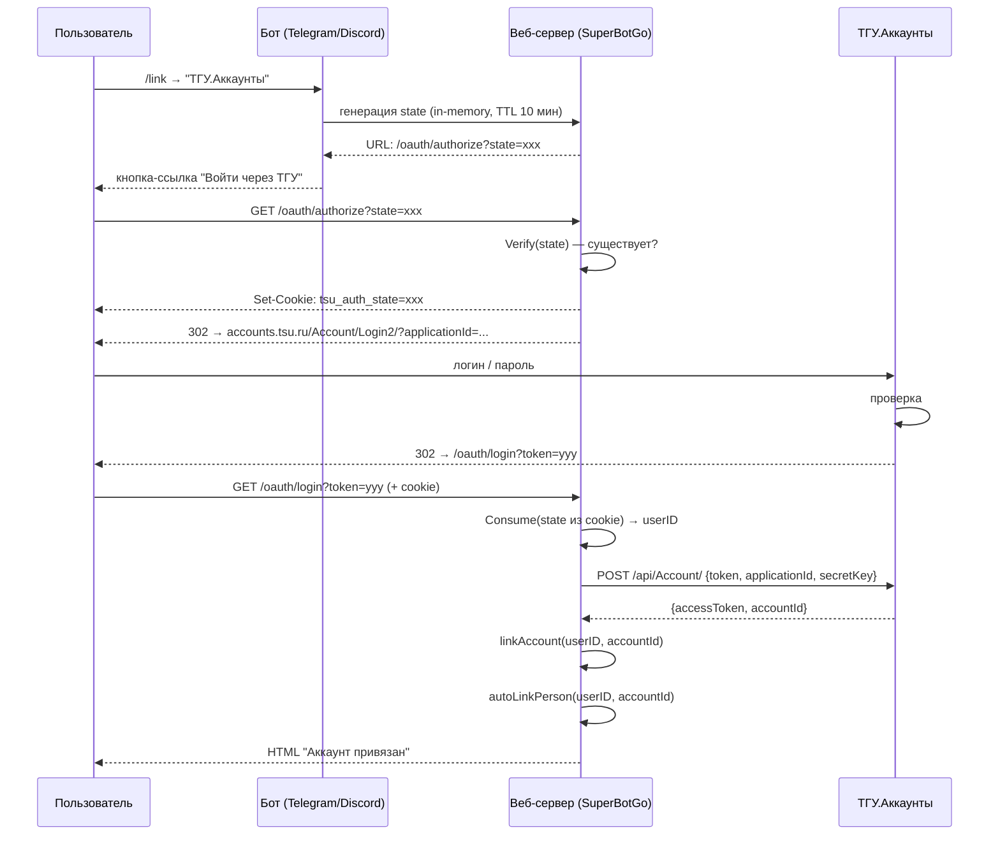
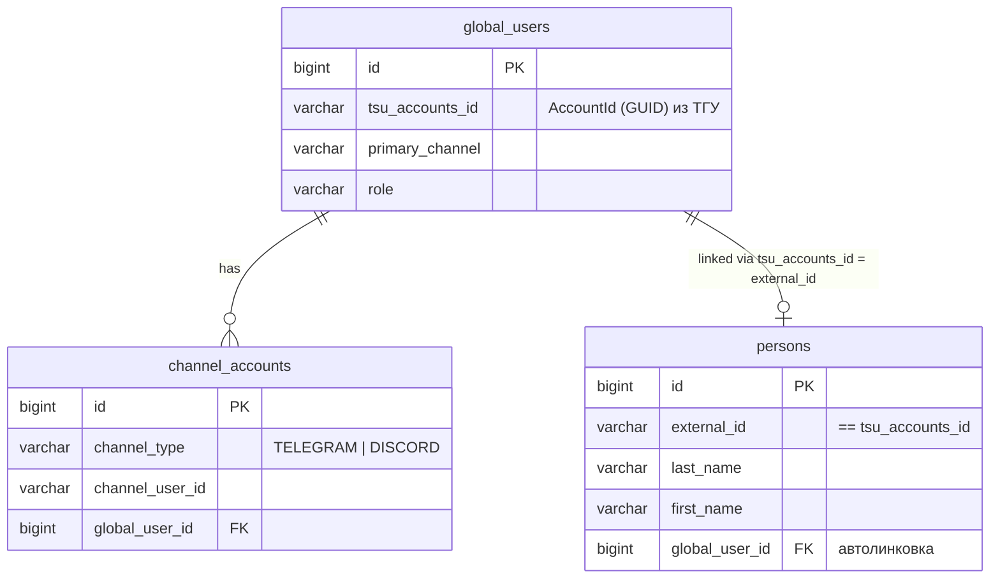

# Авторизация через ТГУ.Аккаунты

Интеграция с внешним сервисом аутентификации **ТГУ.Аккаунты**.
Используется для привязки учётной записи ТГУ к глобальному пользователю бота
и автоматической линковки с записью `person` из университетского синка.

## Общая схема



## Модель данных



## Конфигурация

```yaml
tsu_accounts:
  application_id: "12345"
  secret_key: "hoho..."
  callback_url: "https://bot.example.com/oauth/login"
  base_url: "https://accounts.kreosoft.space"
```

Env-переменные:
- `BOT_TSU__ACCOUNTS_APPLICATION__ID`
- `BOT_TSU__ACCOUNTS_SECRET__KEY`
- `BOT_TSU__ACCOUNTS_CALLBACK__URL`
- `BOT_TSU__ACCOUNTS_BASE__URL`

## HTTP-эндпоинты

| Метод | Путь | Описание |
|-------|------|----------|
| GET | `/oauth/authorize?state=...` | Проверяет state, ставит cookie, редирект на ТГУ |
| GET | `/oauth/login?token=...` | Callback от ТГУ: обмен token → AccountId, линковка |
